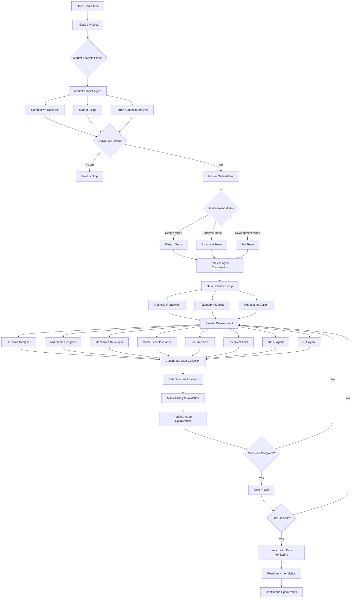

# 🎮 Game Studio Sub-Agents

**AI-Powered Game Development Team in Your Terminal**

*Created by [Tuna Pamir](https://github.com/pamirtuna) - Empowering game developers with AI assistance*

Transform your game ideas into reality with an intelligent team of specialized AI agents. Each agent is an expert in their domain - from game design to QA testing - working together seamlessly to help you create games for any platform.


## ✨ Features

- **🤖 12 Specialized Agents**: Each focusing on their expertise (design, art, programming, QA, market analysis, data science)
- **📊 Data-Driven Development**: Market analysis and analytics from day one
- **🎯 Multiple Development Modes**: Design-only, Prototype, or Full Development
- **🏗️ Automatic Project Structure**: Organized folders and documentation
- **🎨 Multi-Engine Support**: Godot, Unity, Unreal, or custom engines
- **📱 Cross-Platform**: PC, Mobile, Console, Web, VR/AR development
- **🔄 Milestone Tracking**: Automated progress monitoring and reporting
- **📈 Market Intelligence**: Competitive analysis and market validation
- **🎯 Engine-Optimized**: Godot, Unity, and Unreal best practices built-in
- **🤖 Smart Agents**: Project-specific agents with engine expertise

## 🚀 Quick Start

### Prerequisites
Before starting, ensure you have these installed:

#### 1. Git
```bash
# Windows (using Chocolatey)
choco install git

# macOS (using Homebrew)
brew install git

# Ubuntu/Debian
sudo apt update && sudo apt install git

# Verify installation
git --version
```

#### 2. Python 3.8+
```bash
# Windows: Download from python.org
# Or using Chocolatey
choco install python

# macOS (using Homebrew)
brew install python

# Ubuntu/Debian
sudo apt update && sudo apt install python3 python3-pip

# Verify installation
python --version
# or
python3 --version
```

#### 3. Node.js (for Mermaid diagram support)
```bash
# Windows (using Chocolatey)
choco install nodejs

# macOS (using Homebrew)
brew install node

# Ubuntu/Debian
curl -fsSL https://deb.nodesource.com/setup_lts.x | sudo -E bash -
sudo apt-get install -y nodejs

# Verify installation
node --version
npm --version
```

#### 4. Claude Code
```bash
# Install Claude Code CLI
npm install -g @anthropic-ai/claude-code

# Or download from: https://claude.ai/code
# Follow the installation guide for your platform

# Verify installation
claude --version

# Login to Claude Code
claude auth login
```

### Installation

```bash
# 1. Clone the repository
git clone https://github.com/pamirtuna/gamestudio-subagents.git
cd gamestudio-subagents

# 2. Optional: Create virtual environment (recommended)
python -m venv venv

# Activate virtual environment
# Windows:
venv\Scripts\activate
# macOS/Linux:
source venv/bin/activate

# 3. Create your first project
python scripts/init_project.py
# Creates: projects/[your-game-name]/

# 4. Start development with Claude
claude "Read agents/market_analyst.md and the project-config.json in projects/[project-name]. Perform a comprehensive market analysis and generate all reports."

# 5. Manage your projects
python scripts/project_manager.py
```

That's it! Your AI game development team is ready to help.

## 🎭 Meet Your AI Team

### Management
- **🎯 Master Orchestrator**: System coordinator and project initializer
- **📊 Producer Agent**: Project manager ensuring timelines and quality

### Intelligence Team
- **📈 Market Analyst**: Competitive analysis and market intelligence
- **🔬 Data Scientist**: Analytics, metrics, and predictive modeling

### Design Team
- **🎨 Sr Game Designer**: Vision holder and systems architect  
- **📝 Mid Game Designer**: Content creator and implementation specialist

### Engineering Team
- **⚙️ Mechanics Developer**: Core gameplay systems engineer
- **✨ Game Feel Developer**: Polish and game juice specialist

### Art Team
- **🖼️ Sr Game Artist**: Art director defining visual style
- **🔧 Technical Artist**: Shaders, VFX, and optimization expert
- **📱 UI/UX Agent**: Interface and user experience designer

### Quality
- **🐛 QA Agent**: Testing, validation, and quality assurance

## 📚 How It Works

### 1. Project Initialization
The system starts with market validation, then project setup:
- **Market Analysis**: Competitive research and opportunity assessment
- **Project Setup**: Organized folders and agent configuration  
- **Documentation**: Templates and milestone schedules
- **Analytics Setup**: Telemetry and metrics planning

### 2. Development Modes

#### 🎨 Design Mode
Perfect for exploring ideas without committing to development:
- **Market Validation**: Competitive analysis and target audience research
- **Design Documentation**: Complete game design with data backing
- **Art Direction**: Style exploration based on market research
- **Technical Assessment**: Multi-engine feasibility analysis

#### 🚧 Prototype Mode
Quickly validate your core gameplay:
- **Market-Informed Design**: Based on competitive analysis
- **Rapid Prototyping**: Core mechanics with telemetry
- **Data Collection**: Player behavior and engagement metrics
- **Performance Validation**: Technical and market viability

#### 🎮 Development Mode
Full production pipeline with all agents:
- **Data-Driven Development**: Analytics throughout production
- **Market-Aware Implementation**: Features based on competitive research
- **Continuous Optimization**: A/B testing and performance monitoring
- **Quality Assurance**: QA with telemetry integration

### 3. Agent Coordination
Agents communicate through structured protocols:
```
User → Master Orchestrator → Market Analysis → Producer → Specialized Agents → Data Collection → Optimization
```

## 🔄 System Workflow Schematic



### How the System Works:

#### **Phase 1: Market Validation** 🎯
1. **User Input**: Provides game concept and competitor information
2. **Market Analyst**: Analyzes market opportunity, competition, and audience
3. **Go/No-Go**: Data-driven decision to proceed or pivot

#### **Phase 2: Team Assembly** 🤖
4. **Master Orchestrator**: Selects appropriate agents based on project mode
5. **Producer Agent**: Coordinates team and establishes workflows
6. **Data Scientist**: Sets up analytics and testing frameworks

#### **Phase 3: Parallel Development** ⚡
7. **Design Agents**: Create game systems with market insights
8. **Art Agents**: Develop visuals based on competitive analysis  
9. **Engineering Agents**: Build mechanics with telemetry integration
10. **QA Agent**: Tests with performance monitoring

#### **Phase 4: Continuous Optimization** 📈
11. **Data Collection**: Real-time metrics from all development phases
12. **Analysis Loop**: Data Scientist analyzes, Market Analyst validates, Producer optimizes
13. **Iteration**: Teams adjust based on data insights

#### **Phase 5: Launch & Beyond** 🚀
14. **Market-Ready Release**: Launched with proven data backing
15. **Post-Launch Monitoring**: Continuous analytics and optimization
16. **Long-term Success**: Data-driven updates and improvements

## 📁 Project Management

The system includes powerful project management capabilities:

### Project Creation
```bash
# Interactive project setup with engine selection
python scripts/init_project.py
# Creates: projects/[your-game-name]/
# ✨ Automatically configures for your chosen engine (Godot/Unity/Unreal)
# ✨ Creates engine-specific folder structure
# ✨ Generates project-specific agents with engine expertise
```

### Project Management Commands
```bash
# Show all projects
python scripts/project_manager.py status

# Show specific project details
python scripts/project_manager.py status my-game

# Resume work on a project
python scripts/project_manager.py resume my-game

# Pause project indefinitely
python scripts/project_manager.py freeze my-game

# Reset project to start over
python scripts/project_manager.py startover my-game

# Interactive menu
python scripts/project_manager.py menu
```

### Project Structure
Each project is created with engine-optimized structure:

#### Godot Projects
```
projects/your-game-name/
├── agents/                     # 🆕 Project-specific agents
├── project-config.json         # Project configuration
├── documentation/              # Design & technical docs
├── source/                     # Godot project
│   ├── project.godot          # Godot project file
│   ├── scenes/                # Game scenes (.tscn)
│   ├── scripts/               # GDScript files (.gd)
│   ├── assets/                # Sprites, models, audio
│   ├── autoload/              # Global scripts
│   └── addons/                # Godot plugins
├── qa/                        # Testing plans
└── builds/                    # Export builds
```

#### Unity Projects
```
projects/your-game-name/
├── agents/                     # 🆕 Project-specific agents
├── project-config.json         # Project configuration
├── documentation/              # Design & technical docs
├── source/                     # Unity project
│   ├── Assets/                # Unity assets folder
│   │   ├── Scripts/           # C# scripts
│   │   ├── Scenes/            # Unity scenes
│   │   ├── Prefabs/           # Game object prefabs
│   │   └── Materials/         # Materials & shaders
│   ├── Packages/              # Package manager
│   └── ProjectSettings/       # Unity project settings
├── qa/                        # Testing framework
└── builds/                    # Build outputs
```

#### Unreal Projects
```
projects/your-game-name/
├── agents/                     # 🆕 Project-specific agents
├── project-config.json         # Project configuration
├── documentation/              # Design & technical docs
├── source/                     # Unreal project
│   ├── ProjectName.uproject   # Unreal project file
│   ├── Content/               # Game content
│   │   ├── Blueprints/        # Blueprint classes
│   │   ├── Maps/              # Game levels
│   │   ├── Materials/         # Materials & shaders
│   │   └── Audio/             # Sound assets
│   ├── Source/                # C++ source code
│   └── Config/                # Configuration files
├── qa/                        # Testing suite
└── builds/                    # Packaged builds
```

### Project Status Tracking
- **🟢 Active**: Currently being developed
- **🟡 Paused**: Temporarily stopped
- **🔵 Frozen**: Long-term pause
- **✅ Completed**: Finished and released
- **❌ Cancelled**: Abandoned

## 🎮 Engine-Specific Features

### Intelligent Agent Customization
Each project gets **customized agents** based on your engine choice:

#### Godot Agents Know:
- **GDScript best practices** and node-based architecture
- **Signal-driven programming** patterns
- **Godot's built-in physics** and rendering
- **Scene composition** and resource management
- **Export templates** for all platforms

#### Unity Agents Know:
- **C# programming** and component architecture
- **Unity's Package Manager** and ecosystem
- **Scriptable Objects** and data management
- **UGUI and UI Toolkit** for interfaces
- **Build pipelines** and platform deployment

#### Unreal Agents Know:
- **Blueprint and C++ hybrid** development
- **Unreal's Gameplay Framework** patterns
- **Material Editor** and rendering pipeline
- **UMG widget system** for UI
- **Platform-specific optimizations**

### Automated Best Practices
- **Folder structures** follow engine conventions
- **Naming conventions** match engine standards
- **Project files** created with optimal settings
- **Development workflows** tailored to engine strengths

## 💡 Example Workflows

### Creating a Mobile Puzzle Game
```bash
python scripts/init_project.py
# Select: Mobile, Casual, Design Mode

claude "Design a match-3 puzzle game with a space theme"
# Agents will create complete design documentation
```

### Building a PC Indie Game
```bash
python scripts/init_project.py  
# Select: PC, Core, Development Mode

claude "Create a 2D platformer with procedural levels"
# Full team activates for complete development
```

### Rapid Prototyping
```bash
python scripts/init_project.py
# Select: Any platform, Prototype Mode, Rapid timeline

claude "Build a prototype to test this combat mechanic"
# Focused team creates playable prototype in days
```

## 📁 Project Structure

```
your-game/
├── documentation/          # All design and technical docs
│   ├── design/            # GDD, systems, mechanics
│   ├── art/               # Style guides, concepts
│   └── production/        # Timeline, milestones
├── source/                # Game source code
│   ├── assets/           # Art, audio, UI
│   └── scripts/          # Game logic
├── qa/                    # Testing and bug reports
└── project-config.json    # Project configuration
```

## 🛠️ Advanced Features

### Custom Agent Creation
Extend the system with your own specialized agents:
```python
# Create new agent template
# Update orchestrator configuration  
# Add to workflow pipelines
```

### CI/CD Integration
Automate builds and deployment:
```yaml
# GitHub Actions, GitLab CI, Jenkins supported
# Automated testing and release pipelines
```

### Multi-Project Management
Handle multiple games simultaneously:
```bash
# Each project isolated in its own folder
# Switch between projects seamlessly
# Share assets and code between projects
```

## 📖 Documentation

- **[Setup Guide](SETUP.md)** - Detailed installation and configuration
- **[Agent Documentation](agents/README.md)** - Individual agent capabilities
- **[Templates](templates/README.md)** - Production-ready templates for all workflows
- **[Example Workflows](example_workflows.md)** - Common development patterns
- **[System Verification](SYSTEM_VERIFICATION.md)** - Complete validation report
- **[API Reference](docs/api.md)** - For advanced integration

## 🤝 Contributing

We welcome contributions! See [CONTRIBUTING.md](CONTRIBUTING.md) for guidelines.

### Ways to Contribute
- 🐛 Report bugs and issues
- 💡 Suggest new features
- 📝 Improve documentation
- 🤖 Create new agent templates
- 🎮 Share your games built with the system

## 📜 License

This project is licensed under the MIT License - see [LICENSE](LICENSE) file for details.

## 🙏 Acknowledgments

**Created by Tuna Pamir** - This project represents a vision to democratize game development through AI assistance.

Special thanks to:
- Claude (Anthropic) for powering the AI capabilities
- The game development community for continuous inspiration
- Early adopters and testers for valuable feedback
- Open source contributors who help improve the system
- Everyone who stars, shares, and supports this project

## 🌟 Showcase

Games built with Game Studio Sub-Agents:
- *[Add your game here!]*

## 🧪 Testing & Validation

Verify your installation is working correctly:

```bash
# Test the complete workflow
python scripts/test_project_workflow.py

# Test engine-specific features
python scripts/test_engine_system.py

# Should show all PASS results
```

This validates:
- All required files are present
- Python scripts have valid syntax
- Project structure can be created
- All 12 agents are available
- Engine configurations are valid
- Project-specific agents work correctly
- Engine-specific folder structures are created
- Engine project files are generated properly

## 📞 Support

- **Issues**: [GitHub Issues](https://github.com/pamirtuna/gamestudio-subagents/issues)
- **Discussions**: Coming Soon
- **Wiki**: Coming Soon

## 🚦 Roadmap

- [x] Core agent system
- [x] Project initialization  
- [x] Multi-engine support
- [x] Market analysis tools
- [x] Data science integration
- [x] Engine-specific customization
- [ ] Visual project dashboard
- [ ] Cloud collaboration features
- [ ] Asset generation pipeline
- [ ] Automated playtesting

## 🎯 Who Is This For?

- **Indie Developers**: Augment your small team with AI specialists
- **Solo Developers**: Get expert help in areas outside your expertise
- **Game Designers**: Quickly prototype and document ideas
- **Students**: Learn game development with AI mentorship
- **Studios**: Accelerate pre-production and prototyping

## 💬 Community

Join our growing community:
- [Discord Server](#) - Coming Soon
- [Forum](#) - Coming Soon
- [Twitter](#) - Coming Soon

---

## 👨‍💻 Author

**Tuna Pamir**
- GitHub: [@pamirtuna](https://github.com/pamirtuna)
- Project: [Game Studio Sub-Agents](https://github.com/pamirtuna/gamestudio-subagents)

This project is free and open source for the game development community. If you find it helpful, please consider:
- ⭐ Starring the repository
- 🔄 Sharing with other developers
- 🐛 Contributing improvements
- 💬 Providing feedback

---

**Ready to build your dream game?** Get started in minutes with our [Quick Start](#-quick-start) guide!

*Made with ❤️ by Tuna Pamir for game developers worldwide*